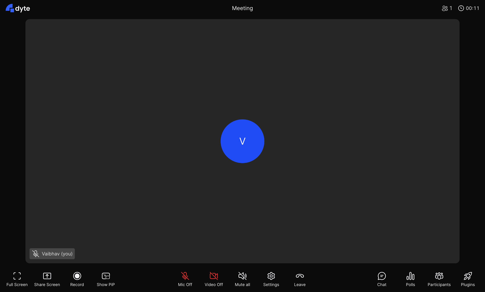

# Dyte기반 기본 미팅 예제

- Dyte의 react ui kit을 이용해서 좀 더 간단하게 화상회의를 임베딩하는 예제
- '@dytesdk/react-ui-kit'의 DyteMeeting 컴포넌트를 이용하여 거의 개발없이 리액트 프로젝트에 추가함.
- 사전에 authToken을 생성 후에 해당 token을 url입력시 property로 넘겨주어야 함.
- 예: http://localhost:5173/?authToken=eyJh.......

---

Just pop in the `<DyteMeeting />` component, and pass the initialised
`meeting` object to it and you're good to go!

[See source](./src/App.tsx)
