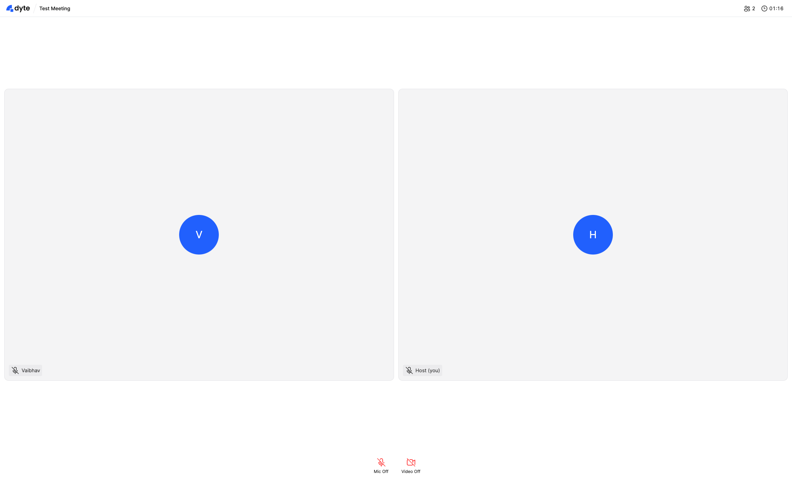

# 간단한 Dyte 이용한 화상회의 예제
- 화상회의의 여러 기능을 조합하여 자신만의 화상회의 서비스를 구성하고 싶을 때 좀 더 자유도 있는 컴포넌트를 제공. 
- 사용하고 있는 컴포넌트들: react-ui-kit의
  - DyteAudioVisualizer
  - DyteParticipantTile,
  - DyteNameTag,
  - DyteAvatar,
  - DyteMeetingTitle,
  - DyteClock,
  - DyteMicToggle,
  - DyteCameraToggle,
  - DyteParticipantCount,
  - DyteParticipantsAudio,
  - DyteSetupScreen
## 사용법
- 사전에 authToken을 생성 후에 해당 token을 url입력시 property로 넘겨주어야 함.
- 예: http://localhost:5173/?authToken=eyJh.......

## authToken 생성하는 법

---

[See source](./src/components/Meeting.tsx)
